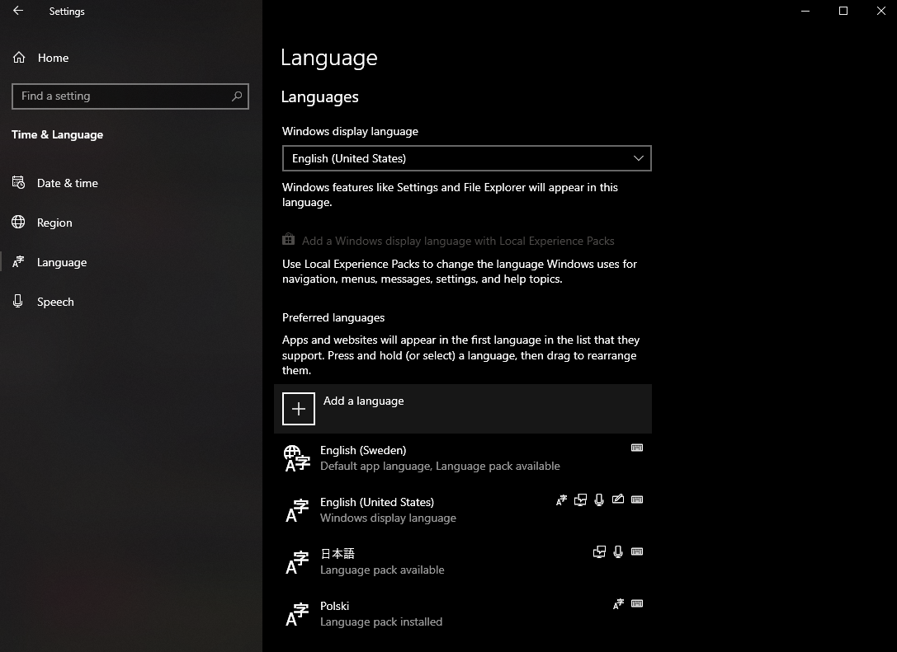

# Perplex TTS
## Browser Twitch TTS.
**EXPERIMENTAL BROWSER SUPPORT:** MAY NOT WORK ON SAFARI OR OPERA.

[Check MDN for browser compatibility.](https://developer.mozilla.org/en-US/docs/Web/API/SpeechSynthesis#Browser_compatibility)

**Note: This works as a browser source on OBS version 27.2 and above.**

### What it does
Plays messages, written in the specified channel with a specific prefix, with a TTS.
[Video showcase.](https://streamable.com/e4q6fp)

### How to try it out
  1. Browse to https://alremahy.com/perplex-tts.html
  2. Change the default values.
  3. Click on save settings.
  4. Click on "Click here to enable TTS!".
  5. Join the provided Twitch channel.
  6. Type a message prefixed by the command prefix, if you left the value as default then type like so `!tts Hello world!`.

### How to use it
  * Adding `lang:xx-xx` before the text will change which language and/or synthesizer it will use.
  * Adding `rate:0.5` to `rate:2` will change how fast it reads a message. Input: Double value from 0.5, 0.6, etc... to a maximum value of 2.
  * Adding `pitch:0` to `pitch:2` will change the pitch of the synthesizer. Input: Double value from 0, 0.1, etc... to a maximum value of 2.
  * Adding `volume:0` to `volume:<user-defined>` will change the volume of the TTS. Input: Double value from 0, 0.1, 0.2 etc... to a maximum value of whatever the value is set in your settings.

**These values can be combo'd, like so:**
```
!tts lang:ja-jp Haruka is maybe my sister, she sounds just like me.
lang:ja-jp-4 You are not my sister, we are not related.
lang:ja-jp-3 Relax, relax. It's just a big misunderstanding.
lang:ja-jp-2 volume:0.5 Please be quiet, I'm trying to play video games.
lang:es-mx volume:1 I can fix it, I'm the Mexican, two time back to back relationship fixer.
rate:2 yayayayayayayayayayayayaya
rate:1 My name is
rate:2 volume:0.5 Rauuuuuuuuuuuuuuuuuuu
volume:1 uuuuuuuuuuuuuuuuuuuuuuuuuuuuuul.
```

### How to get more TTS voices
  * Install TTS voices via Windows 10 settings:
    <p align="center">
      
      <br>Make sure they have the "Text-To-Speech" icon that looks like this 👉  before installing them. <strong>Also, you may be required to restart your PC after installing new languages. Most of those TTSes have multiple voices but only 1 comes enabled by default. <a href="https://www.ghacks.net/2018/08/11/unlock-all-windows-10-tts-voices-system-wide-to-get-more-of-them/">There are ways of enabling the rest of them, but I don't recommend trying it out unless you know how to work the registry editor.</a></strong>
    </p>
  * espeak-ng seems to work, but not sure how to modify the default voice or add new ones. Pull request if you have a fix, solution or suggestion.
  * Other ways of getting TTS: Not sure. Maybe you know of some? Create new issue or make a pull request.

### How to build it yourself
  1. Make sure you have NodeJS (Latest LTS works).
  2. `npm i` to install modules.
  3. `npm build` to build it.
  4. You can now host the contents of the `/dist` folder wherever you'd like.
  * For testing purposes you can try it out locally with python3:
    * `npm run python3-http-server`

### What it uses
  * [dank-twitch-irc](https://github.com/robotty/dank-twitch-irc) for retrieving Twitch messages.
  * [uHTML](https://github.com/WebReflection/uhtml) for rendering HTML templates.
  * [Bulma](https://github.com/jgthms/bulma) for the styling.
  * [node-sass](https://github.com/sass/node-sass) for stylesheet management.
  * [Parcel 2](https://github.com/parcel-bundler/parcel/) for packing the files for use in the browser.
  * [SpeechSynthesis Browser API](https://developer.mozilla.org/en-US/docs/Web/API/Web_Speech_API/Using_the_Web_Speech_API#Speech_synthesis) for the speech synthesis. No external APIs used here.

### TODO:
  * Allow TTS voices to be renamed.

### Ideas for the future
  * Not requiring the user to click on the big red button to make it work.
  * Got more ideas? Open up an issue!
